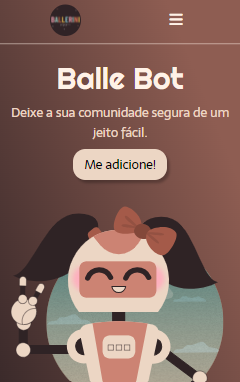
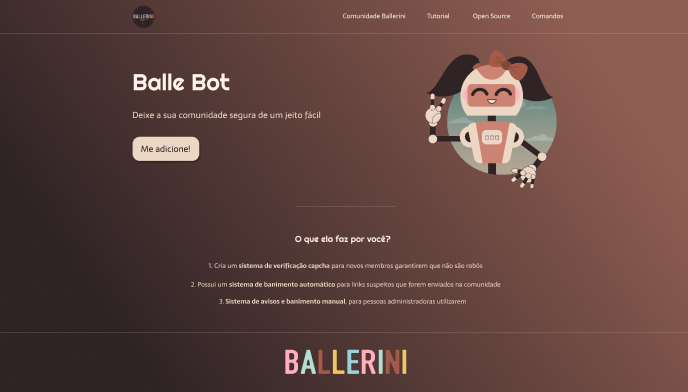

|      MOBILE         |          DESKTOP       |
|:-------------------:|:-----------------------:
|||
|                     |                        |  

## Sobre:
O objetivo deste projeto é colocar em prática os conhecimentos sobre FrontEnd adquiridos no curso do [SENAI Jandira](https://jandira.sp.senai.br/).

---

## Tecnologias utilizadas:
- CSS
- HTML
- Figma
- Markdown
- JavaScript
- Responsividade
---

## Figma:
[Clique aqui](https://www.figma.com/file/myqP66iQwzjwjrIAJyyrip/BalleBot?type=design&node-id=0-1&t=T2yg1wWTWoCFperM-0) para acessar o layout feito no figma.

## **Autora**

| NOME                                                                                                                                                                                      |                                                     GITHUB                                                      |                                       FOTO                                       |
| :----------------------------------------------------------------------------------------------------------------------------------------------------------------------------------------- | :-------------------------------------------------------------------------------------------------------------: | :------------------------------------------------------------------------------: |
|  |      | </a> |
